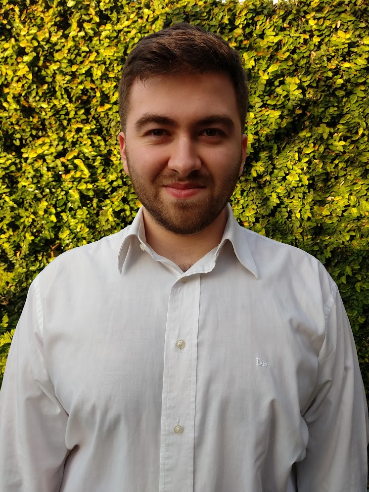

Bienvenidos a
# Mi presentación de GitHub

## Mi nombre es **Federico Nicolas Depaulo**, y soy estudiante de la carrera Tecnicatura Universitaria en Programación.

```
object programacionConObjetos { 
    method saludar() { 
        return  "Hola mundo!" 
    }
}
```

## Datos sobre mi y la cursada :book:
* Tengo 23 años
* Estoy en la comisión **noche**: Martes 18hs.
* Este cuatrimestre los profesores son Gerardo González y Hernán Coniglio
* Además los colaboradores son Valentino Chiappanni, Lucas Bonadeo y Matías Müller

## Links y cosas importantes :monocle_face:
- [x] [Mi LinkedIn](https://www.linkedin.com/in/federico-depaulo-2805a1242/)
- [x] [Mi Gmail de la facultad] <federiconicolas.depaulo@estudiantes.unahur.edu.ar

### Mis gustos
* Me gusta cualquier helado que una persona es muy dulce.
* Me gusta jugar de arquero en fútbol y soy hincha de boca. :blue_heart: :yellow_heart: :blue_heart:
* Soy fan de la saga Resident Evil y uno de mis favoritos es Resident Evil 4. :zombie_man:

#Gracias por ver mi presentación!